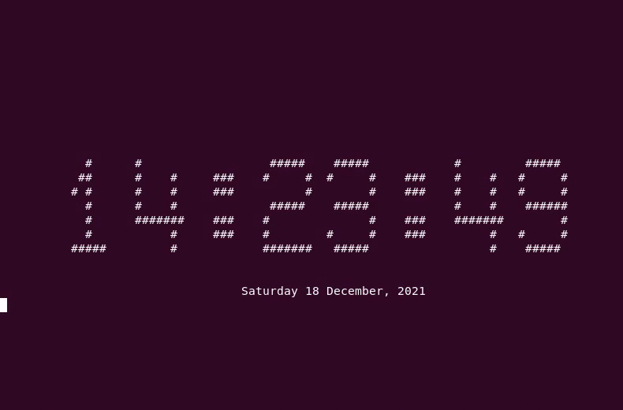

# Simple Digital Clock


## Algorithm


### how to convert  
At first, We make a simple 7x7 grid for `0 1 2 3 4 5 6 7 8 9 :` characters which are all needed character to show time.


Then consider empty cells as `0` and filled cells as `1`.


Now convert binary digits into decimals.


for example:
```
⬜⬛⬛⬛⬛⬛⬜   --> 0 1 1 1 1 1 0 -->  62
⬛⬜⬜⬜⬜⬜⬛   --> 1 0 0 0 0 0 1 -->  65
⬜⬜⬜⬜⬜⬜⬛   --> 0 0 0 0 0 0 1 -->   1
⬜⬛⬛⬛⬛⬛⬜   --> 0 1 1 1 1 1 0 -->  62
⬛⬜⬜⬜⬜⬜⬜   --> 1 0 0 0 0 0 0 -->  64
⬛⬜⬜⬜⬜⬜⬜   --> 1 0 0 0 0 0 0 -->  64
⬛⬛⬛⬛⬛⬛⬛   --> 1 1 1 1 1 1 1 --> 127
```

We should do upper operation for all needed character to get the SYMBOLS dictionary like below:

```python
SYMBOLS = {
    '0': ( 28,  34,  65,  65,  65,  34,  28),
    '1': ( 16,  48,  80,  16,  16,  16, 124),
    '2': ( 62,  65,   1,  62,  64,  64, 127),
    '3': ( 62,  65,   1,  62,   1,  65,  62),
    '4': ( 64,  66,  66,  66, 127,   2,   2),
    '5': (127,  64,  64, 126,   1,  65,  62),
    '6': ( 62,  65,  64, 126,  65,  65,  62),
    '7': (127,  66,   4,   8,  16,  16,  16),
    '8': ( 62,  65,  65,  62,  65,  65,  62),
    '9': ( 62,  65,  65,  63,   1,  65,  62),
    ':': (  0,  28,  28,   0,  28,  28,   0)
}
```

Then we get terminal's dimensions:

```python
WIDTH, HEIGHT = shutil.get_terminal_size()
```

Here is the main loop of the program:

```python
old_time = ''
while True:
    time = datetime.now().strftime('%H:%M:%S')
    date = datetime.now().strftime('%A %d %B, %Y')
    if time != old_time:
        show(time, date)
    old_time = time
```

The upper loop calls `show` function every time the clock changes.

## `show` function

```python
01 def show(time, date):
02    if sys.platform == 'win32':
03        os.system('cls')
04    else:
05        os.system('clear')
06    print('\n' * (HEIGHT // 2 - 4))
07    for row in range(7):
08        print(' ' * (WIDTH // 2 - 35), end='')
09        for ch in time:
10            for i in range(6, -1, -1):
11                if SYMBOLS[ch][row] & (2**i):
12                    print('#', end='')
13                else:
14                    print(' ', end='')
15            print('  ', end='')
16        print()
17    print('\n\n', ' ' * (WIDTH // 2 - len(date) // 2), date)
```

The code clears the screen first (lines 02 to 05), then prints some empty lines to
align vertical placement of clock in the center of screen (line 06).

The `for` loop in line 07 prints single line of clock in each
of its iterations.

In line 08 we print some spaces to align the clock horizontally.

The loop in line 09 iterates over characters of the clock string and prints
`row`th line of each character.

In line 10 we iterate over pixels of the font from left to right and print
the pixels in lines 11 to 14.

In line 11 to 14 we check pixel value using a bitwise `and`
operator and print `#` for `1` and a space for 0 bits.

Line 15 prints a new line and ends `row`th line of the clock.

Line 16 prints a blank line to separate date from printed digital clock.

Line 17 prints center-aligned date.


